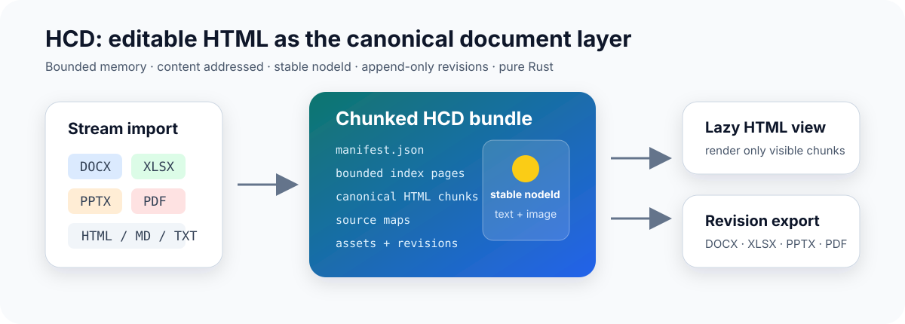
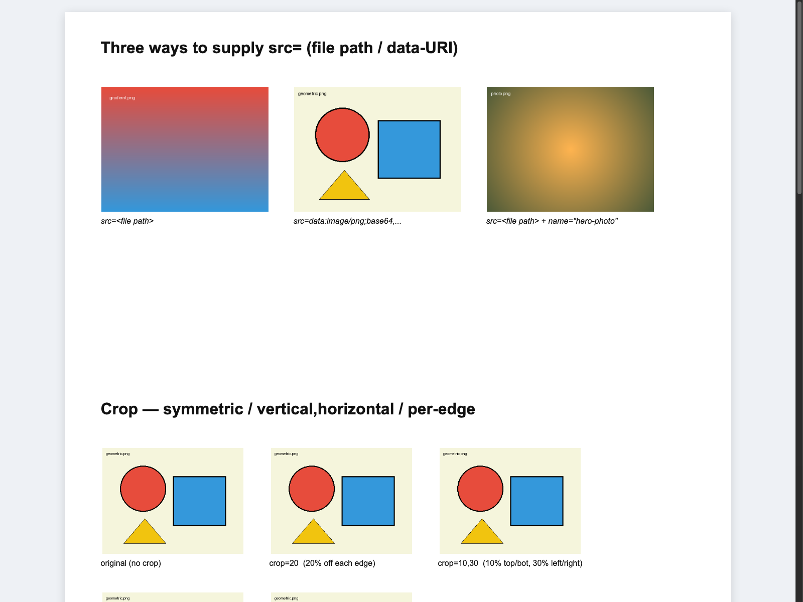
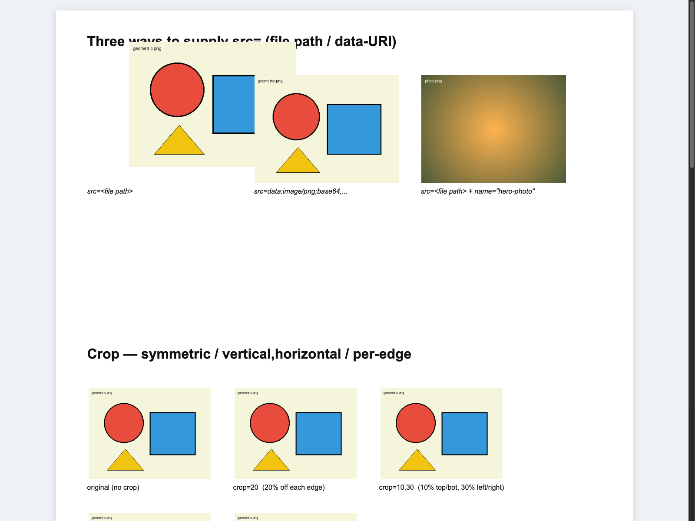

# OfficeCLI (Rust)

> **面向 AI 智能体的纯 Rust CLI — 创建、读取、修改和渲染 Office 文档与 PDF。**

**让任何 AI 智能体通过结构化方式掌控 Word、Excel、PowerPoint 和 PDF — 只需一行代码。**

开源免费。单一二进制。无需安装 Office。无运行时依赖。支持 macOS、Linux 和 Windows。

[](https://github.com/RainLib/OfficeCli-rust/releases)
[](LICENSE)
[](https://www.rust-lang.org/)

[English](README.md) | **中文** | [日本語](README_ja.md) | [한국어](README_ko.md)

## 关于本仓库

这是 **[RainLib/OfficeCli-rust](https://github.com/RainLib/OfficeCli-rust)** — [OfficeCLI](https://github.com/iOfficeAI/OfficeCLI) 的 **Rust 重写版**。OfficeCLI 最初由 [iOfficeAI](https://github.com/iOfficeAI) 以 C#/.NET 构建，是开源的 Office 自动化 CLI。

| | **本仓库 (Rust)** | **[上游 (C#)](https://github.com/iOfficeAI/OfficeCLI)** |
|---|---|---|
| 仓库 | [RainLib/OfficeCli-rust](https://github.com/RainLib/OfficeCli-rust) | [iOfficeAI/OfficeCLI](https://github.com/iOfficeAI/OfficeCLI) |
| 语言 | 纯 Rust | C# / .NET（自包含二进制） |
| 版本 | v0.1.x（命令对等） | v1.0.x（成熟，6k+ stars） |
| 运行时 | 无 — 原生二进制 | 二进制内嵌 .NET |
| PDF 支持 | ✅ 读取 / 修改 / 预览 | 通过插件 |
| 目标 | 轻量、可审计、可嵌入的 Rust 核心 | 功能完备的生产级 CLI + 生态 |

Rust 版共享相同的 **CLI 理念** — 基于路径的 DOM 操作、JSON 输出、TextOffsetMap、三层架构、MCP 服务器和实时 HTML 预览 — 并已达到与 C# 上游的**命令级对等**。剩余差距在边缘场景保真度和生态工具，而非命令覆盖。需要最大生态集成（AionUi、插件市场）时请使用上游；需要**无依赖的 Rust 二进制**或想参与 Rust 实现时请使用本仓库。

## 支持的格式

| 格式 | 读取 | 修改 | 创建 | 文本/偏移映射 | 旧格式转换 |
|------|------|------|------|---------------|-----------|
| Word (.docx) | ✅ | ✅ | ✅ | ✅ | ✅ .doc → .docx |
| Excel (.xlsx) | ✅ | ✅ | ✅ | ✅ | ✅ .xls → .xlsx |
| PowerPoint (.pptx) | ✅ | ✅ | ✅ | ✅ | ✅ .ppt → .pptx |
| PDF (.pdf) | ✅ | ✅（文本替换、删除页面） | ✅ | ✅ | — |

## 新功能：HCD — 分片、可编辑的 HTML 文档中间层

HCD 将 **HTML 作为跨文档格式唯一的可编辑正文**。`officecli hdoc import` 不再构造一个
覆盖全文的 DOM，而是把源文件流式转换为有界的、内容寻址的 HTML 分片、source map、
asset 和不可变 revision。前端可以只加载当前可见页面，后端修改仍精确定位到稳定的
`nodeId`。



### 新链路提供的能力

- **统一编辑模型：** DOCX、XLSX、PPTX、PDF、HTML、Markdown 和 TXT 均转换为具有格式
  profile 的 canonical HTML fragment。
- **稳定寻址：** 可编辑文字和已映射图片均有确定性的 `nodeId`；源文件字节和
  `documentId` 相同时，重复导入得到相同 ID。
- **增量版本：** `text.splice`、批注、`image.replace`、`image.geometry` 追加 revision，
  不覆盖旧版本；hash 前置条件检测冲突，`patchId` 支持幂等重试。
- **低内存加载：** 每个索引页最多包含 128 个分片描述；全量 HTML 和局部窗口共享同一
  bundle，示例查看器只在 DOM 中保留有限的可见区域缓存。
- **可校验 asset：** 栅格图片按内容寻址、校验 hash、随 revision 管理，无需在每个 HTML
  fragment 中重复嵌入 Base64。
- **纯 Rust 导出：** 可将指定 revision 重建为 DOCX、XLSX、PPTX、PDF、Markdown 或 TXT，
  不调用 LibreOffice；提供不可变原文件时，受支持的文本修改走 source-backed 回写，
  未修改的 OOXML entry 保持不变。

### 快速完成一次 HCD 闭环

```bash
# 渐进导入；导入完成前即可消费 chunk_ready 事件。
officecli hdoc import report.docx --output report.hcd --events ndjson

# 校验内容 hash、分页读取文本，并只渲染第 20–29 个分片。
officecli hdoc validate report.hcd --json
officecli hdoc extract-text report.hcd --limit 100 --json
officecli hdoc render-html report.hcd --chunk-start 20 --chunk-limit 10 \
  --output report-window.html --json

# 通过 nodeId 修改并查看 append-only revision 历史。
officecli hdoc apply report.hcd --patch patch.json --expected-revision 0 --json
officecli hdoc list-revisions report.hcd --json

# 使用进程内 Rust handler 重建；受支持的原文件回写可额外传入 --source。
officecli hdoc export report.hcd --revision 1 --output report-revision-1.docx --json
```

独立的懒加载前端位于 [`examples/hdoc/lazy-viewer`](examples/hdoc/lazy-viewer)。它分别读取
索引页与分片、校验 hash，并在 DOM 淘汰和重新加载后保持 `nodeId` 不变。

### 图片节点：通过 `nodeId` 替换内容和矩形

下面的真实 PPTX 示例先导入 HCD，再替换并调整一个图片节点的尺寸。图片的 `nodeId`
保持不变，revision 1 使用新的 asset 与 geometry 计算新的 `visualHash`。

| Revision 0 | 执行 `image.replace` + `image.geometry` 后的 Revision 1 |
| --- | --- |
|  |  |

```bash
officecli hdoc list-images presentation.hcd --limit 20 --json
officecli hdoc get-image presentation.hcd <nodeId> --json
officecli hdoc put-asset presentation.hcd replacement.png --json
officecli hdoc apply presentation.hcd --patch image-patch.json \
  --expected-revision 0 --json
```

可复现的 patch 位于
[`examples/hdoc/image-patch/patch-pictures-basic.json`](examples/hdoc/image-patch/patch-pictures-basic.json)。
生成的 `.hcd` bundle 与预览输出仅保留在本地，并已明确排除在 Git 之外。

### 保真度边界

HCD 会明确报告 fidelity，不笼统宣称所有格式都能像素级 1:1。DOCX 导入目标为高保真
语义流；XLSX 使用可虚拟化 grid；PPTX 使用 slide-canvas geometry；PDF 使用固定页面布局。
不支持的 Office/PDF 结构尽可能通过不可变原文件保留，并记录 fidelity warning。当前
source-backed 图片/媒体回写会在写文件前拒绝执行，避免静默丢弃修改；不带 `--source`
的纯 Rust 重建会包含已修改的栅格图片。完整契约见
[`docs/hcd-docx-v1.zh.md`](docs/hcd-docx-v1.zh.md)。

## AI 智能体 — 文本/偏移 → 路径映射

每种支持的格式都可输出 **TextOffsetMap** — 完整文本加上字符偏移→路径映射。智能体读取映射，定位待修改文本，获取精确路径（如 `/body/p[3]/r[1]`），再调用 `set` 精确修改。无需正则猜测。

```bash
officecli extract-text report.docx --with-offsets --json
```

```json
{
  "full_text": "你好世界\n第二段",
  "spans": [
    { "start": 0, "end": 2, "path": "/body/p[1]/r[1]", "text": "你好", "element_type": "run" },
    { "start": 2, "end": 4, "path": "/body/p[1]/r[2]", "text": "世界", "element_type": "run" },
    { "start": 4, "end": 10, "path": "/body/p[2]/r[1]", "text": "第二段", "element_type": "run" }
  ],
  "meta": { "format": "docx", "total_chars": 10, "total_spans": 3 }
}
```

**智能体配置** — 将技能文件提供给编码智能体：

```bash
curl -fsSL https://raw.githubusercontent.com/RainLib/OfficeCli-rust/main/SKILL.md
```

或一步安装二进制和技能（见[安装](#安装)）。

## 快速开始

```bash
# 1. 安装（macOS / Linux）
curl -fsSL https://raw.githubusercontent.com/RainLib/OfficeCli-rust/main/install.sh | bash
# Windows（PowerShell）：
#   irm https://raw.githubusercontent.com/RainLib/OfficeCli-rust/main/install.ps1 | iex

# 2. 创建空白 PowerPoint
officecli create deck.pptx

# 3. 添加幻灯片
officecli add deck.pptx / --type slide --prop title="Hello, World!"

# 4. HTML 预览
officecli view deck.pptx --mode html

# 5. 实时预览 — 每次编辑自动刷新
officecli watch deck.pptx
```

在另一个终端中，每次 `add` / `set` / `remove` 都会刷新 `http://localhost:26315` 的浏览器页面。

## 为什么选择 OfficeCLI？

过去需要 50 行 Python 和三个独立库：

```python
from pptx import Presentation
prs = Presentation()
slide = prs.slides.add_slide(prs.slide_layouts[0])
slide.shapes.title.text = "Q4 报告"
# ... 还有几十行 ...
prs.save("deck.pptx")
```

现在只需一条命令：

```bash
officecli add deck.pptx / --type slide --prop title="Q4 报告"
```

**本 Rust 版本的核心能力：**

- **创建** 空白文档或添加结构化内容
- **读取** 文本、大纲、统计、标注视图 — 纯文本或 `--json`
- **修改** 通过路径式 `set` / `add` / `remove` / `move` 操作元素
- **验证** 文档结构并发现问题
- **提取** 带偏移→路径映射的文本，供智能体定位
- **渲染** 文档为 HTML/SVG，获得视觉反馈
- **转换** 旧格式 `.doc` / `.xls` / `.ppt` 为现代格式
- **PDF** — 读取、预览、替换文本、删除页面
- **批量** — 一次打开/保存周期内执行多条操作
- **MCP** — 通过 JSON-RPC 将所有操作暴露为 AI 工具

## 安装

以单一原生二进制分发。纯 Rust — 无需 .NET、Python 或 Office。

**一键安装：**

```bash
# macOS / Linux
curl -fsSL https://raw.githubusercontent.com/RainLib/OfficeCli-rust/main/install.sh | bash

# Windows（PowerShell）
irm https://raw.githubusercontent.com/RainLib/OfficeCli-rust/main/install.ps1 | iex
```

指定版本安装：

```bash
OFFICECLI_VERSION=v0.1.2 curl -fsSL https://raw.githubusercontent.com/RainLib/OfficeCli-rust/main/install.sh | bash
```

**手动下载** [GitHub Releases](https://github.com/RainLib/OfficeCli-rust/releases)：

| 平台 | 二进制文件 |
|------|-----------|
| macOS Apple Silicon | `officecli-mac-arm64` |
| macOS Intel | `officecli-mac-x64` |
| Linux x64 | `officecli-linux-x64` |
| Linux ARM64 | `officecli-linux-arm64` |
| Linux Alpine x64 | `officecli-linux-alpine-x64` |
| Windows x64 | `officecli-win-x64.exe` |
| Windows ARM64 | `officecli-win-arm64.exe` |

```bash
# 下载脚本 — 当前平台，最新已发布版本
./scripts/download.sh

# 指定版本，下载全部平台
./scripts/download.sh v0.1.2 all

# GitHub CLI
gh release download v0.1.2 --repo RainLib/OfficeCli-rust --pattern 'officecli-*'
```

> **发布说明：** 推送 `v*` tag 后 CI 会构建二进制并上传到 **Draft** Release。请先在 [Releases](https://github.com/RainLib/OfficeCli-rust/releases) 页面 Publish，`latest` 下载链接才会生效。请将 tag 推送到 `github` 远程（`git push github v0.1.2`），而非仅推送到内网 `origin`。

验证安装：`officecli --version`

## 核心功能

### 三层架构

从简单开始，仅在需要时深入。

| 层 | 用途 | 命令 |
|----|------|------|
| **L1：读取** | 内容的语义视图 | `view`（text、annotated、outline、stats、issues、html、svg、screenshot、pdf、forms） |
| **L2：DOM** | 结构化元素操作 | `get`、`query`、`set`、`add`、`add-part`、`remove`、`move`、`swap` |
| **L3：原始 XML** | XPath 直接访问 — 通用兜底 | `raw`、`raw-set`、`validate` |

```bash
# L1 — 高级视图
officecli view report.docx --mode annotated
officecli view budget.xlsx --mode stats
officecli view report.pdf --mode text

# L2 — 元素级操作
officecli query report.docx paragraph
officecli add budget.xlsx / --type sheet --prop name="Q2 报告"
officecli remove report.pptx '/slide[3]'

# L3 — L2 不够时用原始 XML
officecli raw deck.pptx 'ppt/slides/slide1.xml'
officecli raw-set report.docx document --xpath "//w:p[1]" --action append \
  --xml '<w:r><w:t>注入文本</w:t></w:r>'
```

### 实时预览与渲染

内置 HTML/SVG 渲染，无需 Office 即可完成 **渲染 → 查看 → 修正** 循环：

```bash
officecli view deck.pptx --mode html     # 独立 HTML 预览
officecli view deck.pptx --mode svg      # SVG 输出
officecli watch deck.pptx                # 实时服务 :26315
```

### 格式转换

多种引擎支持旧格式转换和 PDF 转 DOCX：

```bash
officecli convert old.doc              # .doc -> .docx（LibreOffice，默认）
officecli convert old.xls -o new.xlsx  # .xls -> .xlsx
officecli convert old.ppt --engine oxide  # 纯 Rust 引擎，无外部依赖
officecli convert input.pdf --engine pdf2docx  # PDF -> DOCX，使用 Python pdf2docx
```

| 引擎 | 保真度 | 速度 | 依赖 |
|------|--------|------|------|
| `libreoffice`（默认） | ~1:1 | 较慢（进程启动） | LibreOffice（~700MB） |
| `oxide` | 较低（可能丢失样式/页眉/对象） | 快（亚秒级） | 无（纯 Rust） |
| `pdf-text` | 仅文本 | 最快 | 无（纯 Rust） |
| `pdf2docx` | 版式解析，仅支持 PDF | 通常快于 LO | Python `pdf2docx` CLI |

### 驻留模式与批量执行

驻留模式（Unix）将文档保持在内存中；批量模式在一次周期内执行多条命令。

```bash
# 驻留模式 — Unix Domain Socket，延迟接近零
officecli open report.docx
officecli set report.docx /body/p[1]/r[1] --prop text="已更新"
officecli save report.docx
officecli close report.docx

# 批量模式 — 原子化多命令执行
echo '[{"command":"set","path":"/slide[1]/shape[1]","props":{"text":"你好"}}]' \
  | officecli batch deck.pptx --stdin --json
officecli batch deck.pptx --commands-file batch.json --json
```

### PDF 支持

```bash
officecli view report.pdf --mode text
officecli get report.pdf '/page[1]'
officecli extract-text report.pdf --with-offsets --json
officecli set report.pdf '/page[1]' --prop text="新内容"
officecli remove report.pdf '/page[3]'
officecli save report.pdf
```

## AI 集成

### MCP 服务器

```bash
officecli mcp    # 启动 MCP stdio 服务器（JSON-RPC 2.0）
```

将文档操作暴露为工具 — 无需 shell 访问。

### 内置帮助

```bash
officecli --help
officecli help docx paragraph
officecli help xlsx cell --json
```

不确定属性名时，使用 `officecli help <格式> <元素>` — 内容与已安装的二进制版本一致。

## 对比

### 与传统工具对比

| | OfficeCLI (Rust) | [OfficeCLI (C#)](https://github.com/iOfficeAI/OfficeCLI) | Microsoft Office | python-docx / openpyxl |
|---|---|---|---|---|
| 开源免费 | ✅ Apache 2.0 | ✅ Apache 2.0 | ✗ | ✅ |
| AI 原生 CLI + JSON | ✅ | ✅ | ✗ | ✗ |
| 零运行时（单一二进制） | ✅ (Rust) | ✅ (.NET 内嵌) | ✗ | ✗ (Python + pip) |
| Word + Excel + PowerPoint + PDF | ✅ | ✅ (+ 插件) | ✅ | 需多个库 |
| 文本/偏移 → 路径映射 | ✅ | ✅ | ✗ | ✗ |
| 基于路径的元素访问 | ✅ | ✅ | ✗ | ✗ |
| 实时 HTML 预览 (`watch`) | ✅ | ✅ | ✗ | ✗ |
| MCP 服务器 | ✅ | ✅ (+ 自动注册) | ✗ | ✗ |
| 无头 / CI / Docker | ✅ | ✅ | ✗ | ✅ |

### 与上游 OfficeCLI (C#) 对比

本 Rust 移植版与 C# 上游**API 兼容**（相同命令名、路径语法、`--prop` 约定），并已达到**命令级对等**。剩余差距在边缘场景保真度和生态工具，而非命令覆盖。

| 功能 | 上游 (C#) | 本仓库 (Rust) |
|------|-----------|---------------|
| 模板 `merge`（`{{key}}`） | ✅ | ✅ |
| `view screenshot`（PNG） | ✅ | ✅（无头 Chrome/Edge/Firefox） |
| `view pdf`（PDF 导出） | ✅ | ✅（无头 Chromium `--print-to-pdf`） |
| `view forms`（SDT 表单域） | ✅ | ✅（docx SDT 解析） |
| `swap`、`refresh`、`plugins` | ✅ | ✅ |
| `add-part`（图表/页眉/页脚） | ✅ | ✅ |
| `import`（CSV/TSV → xlsx） | ✅ | ✅ |
| `mark/unmark/marks/goto`（watch） | ✅ | ✅（watch 服务器路由） |
| `officecli install` 自安装 | ✅ | ✅（二进制 + 技能 + MCP） |
| 公式引擎（150+ 函数） | ✅ | ✅（80+ 函数） |
| 数据透视表（列表） | ✅ | ✅（列表 + 源范围） |
| Morph 过渡（报告） | ✅ | ✅（检测 + 候选计数） |
| 3D 模型 | ✅ | ✅（HTML 预览） |
| Python SDK（`officecli-sdk`） | ✅ | ✅（Unix 域套接字 IPC） |
| CLI 冒烟与集成测试 | ✅ | ✅（39 CLI + 32 单元测试） |
| `cargo clippy -D warnings` 零警告 | 不适用 | ✅ |
| AionUi GUI 集成 | ✅ | 不适用（上游生态） |
| Wiki 与 4000+ 次提交打磨 | ✅ | 早期阶段 |

完整命令参考和 Wiki 请跟踪上游：[iOfficeAI/OfficeCLI Wiki](https://github.com/iOfficeAI/OfficeCLI/wiki)。

## 命令参考

| 命令 | 说明 |
|------|------|
| `create` | 创建空白 `.docx`、`.xlsx`、`.pptx` 或 `.pdf` |
| `view` | 查看内容（`text`、`annotated`、`outline`、`stats`、`issues`、`html`、`svg`、`screenshot`、`pdf`、`forms`） |
| `get` | 获取元素及子元素（`--depth N`、`--json`） |
| `query` | CSS 风格查询 |
| `set` | 修改元素属性 |
| `add` | 添加元素 |
| `add-part` | 创建文档部件（图表/页眉/页脚）并返回 rel ID |
| `remove` | 删除元素 |
| `move` | 移动元素 |
| `swap` | 交换两个元素（段落/幻灯片/单元格） |
| `save` | 保存修改到文件 |
| `validate` | 验证文档结构 |
| `extract-text` | 提取文本与偏移→路径映射（`--with-offsets`、`--json`） |
| `convert` | 转换旧格式和 PDF（`--engine libreoffice|oxide|pdf-text|pdf2docx`） |
| `batch` | 单次周期内执行多条操作 |
| `dump` | 将文档结构序列化为可重放 JSON |
| `raw` | 查看文档部件的原始 XML |
| `raw-set` | 通过 XPath 修改原始 XML（`setattr`、`remove`） |
| `import` | 导入 CSV/TSV 数据到 Excel 工作表 |
| `merge` | 合并模板占位符（`{{key}}`）与 JSON 数据 |
| `refresh` | 刷新派生字段（目录、交叉引用） |
| `watch` | 实时 HTML 预览，自动刷新 |
| `unwatch` | 停止运行中的 watch 服务 |
| `open` | 启动驻留模式（Unix） |
| `close` | 保存并关闭驻留模式 |
| `plugins` | 列出、检查和校验已安装插件（`list`、`info`、`lint`） |
| `install` | 安装二进制、技能和 MCP 配置（`--dry-run`、`--prefix`） |
| `info` | 显示工具或文档主题信息 |
| `mcp` | 启动 MCP 服务器，用于 AI 工具集成 |

全局参数：任意命令均可加 `--json` 获取结构化输出。

## 使用场景

**开发者**
- 在 CI/CD 流水线中自动化报告生成
- 在 Docker 中无头处理文档（提供 Alpine musl 构建）
- 嵌入轻量 Rust 二进制，无需 .NET 或 Python 运行时

**AI 智能体**
- 通过 TextOffsetMap → 路径 → `set` 精确修改文本
- 用 `watch` 和 `view html` 形成视觉反馈循环
- 通过 MCP 服务器集成工具

**团队**
- 基于可审计的开源 Rust 代码做内部文档自动化
- 借助兼容的 CLI 语法，从上游 OfficeCLI 逐步迁移

## 从源码构建

需要 [Rust](https://rustup.rs/) 1.75+（CI 固定 1.90.0）。

```bash
git clone https://github.com/RainLib/OfficeCli-rust.git
cd OfficeCli-rust
cargo build --release
# 二进制位于 target/release/officecli
```

交叉编译：

```bash
cargo build --release --target aarch64-apple-darwin    # macOS ARM
cargo build --release --target x86_64-unknown-linux-gnu
cargo build --release --target x86_64-pc-windows-msvc
```

本地分发：

```bash
make dist          # 构建并复制到 dist/，含 SHA256
make download VERSION=v0.1.2 PLATFORM=all  # 下载发布版二进制
make smoke         # 快速冒烟测试
```

## 项目结构

```
OfficeCli-rust/
├── Cargo.toml                 # Workspace 根目录（v0.1.x）
├── install.sh / install.ps1   # 一键安装脚本
├── scripts/download.sh        # 平台二进制下载器
├── SKILL.md                   # AI 智能体技能文件
├── crates/
│   ├── officecli/              # CLI 入口 + 命令
│   ├── handler-common/         # DocumentHandler trait + 共享类型
│   ├── oxml/                   # OOXML ZIP/XML 包处理
│   ├── docx-handler/           # Word 处理器
│   ├── xlsx-handler/           # Excel 处理器
│   ├── pptx-handler/           # PowerPoint 处理器
│   └── pdf-handler/            # PDF 处理器（lopdf + 自定义解析器）
├── examples/                   # 可运行示例（.sh / .md）
└── skills/                     # 专用智能体技能
```

## 贡献

参见 [CONTRIBUTING.md](CONTRIBUTING.md)。每个 PR 应为原子变更，并包含可验证的验证方法（展示前后对比的命令序列）。

Bug 报告和功能请求：[GitHub Issues](https://github.com/RainLib/OfficeCli-rust/issues)

上游参考实现：[iOfficeAI/OfficeCLI](https://github.com/iOfficeAI/OfficeCLI)

## 许可证

[Apache License 2.0](LICENSE)

---

如果觉得本项目有用，请 [在 GitHub 上点个 Star](https://github.com/RainLib/OfficeCli-rust) — 也欢迎为 [上游 OfficeCLI](https://github.com/iOfficeAI/OfficeCLI) 点 Star。

[GitHub — RainLib/OfficeCli-rust](https://github.com/RainLib/OfficeCli-rust) | [上游 — iOfficeAI/OfficeCLI](https://github.com/iOfficeAI/OfficeCLI) | [Releases](https://github.com/RainLib/OfficeCli-rust/releases)

<!-- LLM/agent discovery metadata
tool: officecli
repo: RainLib/OfficeCli-rust
upstream: iOfficeAI/OfficeCLI
type: cli
language: rust
formats: docx, xlsx, pptx, pdf
capabilities: create, read, modify, validate, batch, resident-mode, mcp-server, live-preview, text-offset-mapping, format-conversion
platforms: macos, linux, windows
license: Apache-2.0
skill-file: SKILL.md
-->
