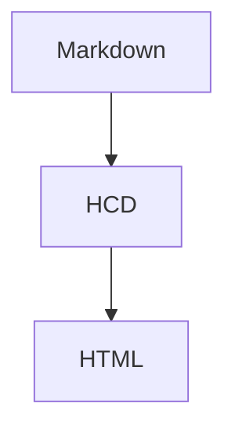

# Markdown 全格式 HCD 验证 {#markdown-all .hcd-demo}

这份文档覆盖 OfficeCLI 当前声明的 CommonMark、GFM 与安全扩展能力，并明确主动内容的安全边界。中文、English、emoji 😀 均应保留。

Secret 123

## ATX 标题

### 三级标题

#### 四级标题

##### 五级标题

###### 六级标题

## 行内格式

普通文本、*星号斜体*、_下划线斜体_、**星号粗体**、__下划线粗体__、***粗斜体***、~~删除线~~、`inline <code>`。

转义字符：\*不是斜体\*、\[不是链接\]、反斜线 \\。

这是一个硬换行测试，行尾使用反斜线。\
这一行必须从新行开始。

## 链接与图片语义

[文字上的安全链接](https://example.com/docs "文档站点") 不应在正文后追加括号 URL。

角括号自动链接：<https://example.org/guide>

邮箱自动链接：<editor@example.org>

裸链接自动识别：https://example.net/path?q=markdown


[危险链接必须降级为普通标签](javascript:alert(1))

## 列表

- 无序项目（减号）
* 无序项目（星号）
+ 无序项目（加号）

3. 有序列表从 3 开始
4. 有序列表继续

- [ ] 未完成任务
- [x] 已完成任务
- [X] 大写 X 任务

## 引用

> 一级引用，包含 **粗体** 与 [链接](https://example.com/quote)。
>> 嵌套引用保留两级 blockquote 结构、内容与 nodeId。

## 分隔线

---

## 围栏代码块

```rust
fn main() {
    println!("emoji 😀 and <xml>");
}
```

~~~json
{"name":"张三","active":true}
~~~

## GFM 表格

| 特性 | 状态 | 说明 |
| :--- | :---: | ---: |
| 中文 | 😀 | 保留 Unicode 与 emoji |
| 行内代码 | `cargo test` | 语义渲染 |
| 转义竖线 | A\|B | 单元格内不拆列 |
| 链接 | [表格链接](https://example.com/table) | 锚文本可点击 |

## 段落与空行

第一段包含多个句子。它用于验证自动换行，而不是绝对坐标叠放。A long English sentence verifies that exported PDF layout wraps naturally within the page width and does not overlap adjacent blocks.

第二段与第一段之间保留一个空行。

## 完整 CommonMark / GFM 与安全扩展

Setext 二级标题
---------------

[引用式链接][reference-id]、[折叠引用][] 与 [快捷引用]。

[reference-id]: https://example.com/reference "引用定义"
[折叠引用]: https://example.com/collapsed
[快捷引用]: https://example.com/shortcut

脚注引用[^note] 与脚注定义均生成可跳转结构。

[^note]: 这是一条脚注定义，包含 **粗体** 和第二段。

    脚注中的后续段落继续属于同一脚注。

术语一
  : 定义列表的第一项

术语二
  : 定义列表的第二项

上标 x ^2^、下标 H ~2~ O、行内数学 $a^2+b^2=c^2$，以及 Wiki 链接 [[HCD 设计|HCD Wiki]]。

$$
E = mc^2
$$

> [!WARNING]
> 这是 GFM warning 提示块，包含嵌套结构：
>
> - 嵌套无序项
>   1. 嵌套有序项

    这是四空格缩进代码块



安全行内 HTML：<mark>高亮</mark>、<kbd>Ctrl</kbd>、H<sub>2</sub>O 和 x<sup>2</sup>。

危险 HTML 安全边界：<script>alert('never execute')</script> 会显示为转义源码，不会执行。

::: warning
冒号扩展提示块也会规范化为安全 aside。
:::
